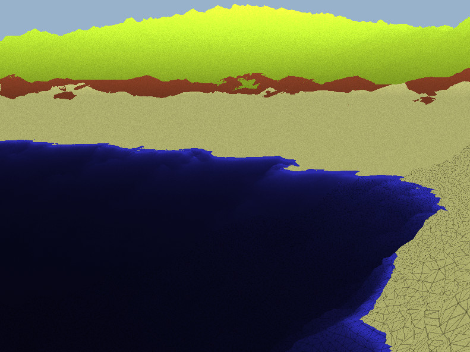

# Farmesh

Real-time procedural landscape generation, rendering and animation!



Dependencies:
```sh
sudo apt install libglfw3-dev
```

Installation:
``` sh
make
```

Run:
``` sh
./main
```

Controls:
- WASD for movement
- K to fly on/off
- number keys control movement speed
- ESC or q to exit
- Mouse or arrow keys turn camera
- Mouse wheel zooms in

License: MIT

Note: I don't own cglm and glad libraries.
